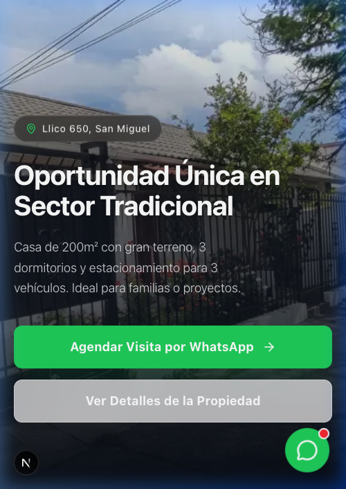
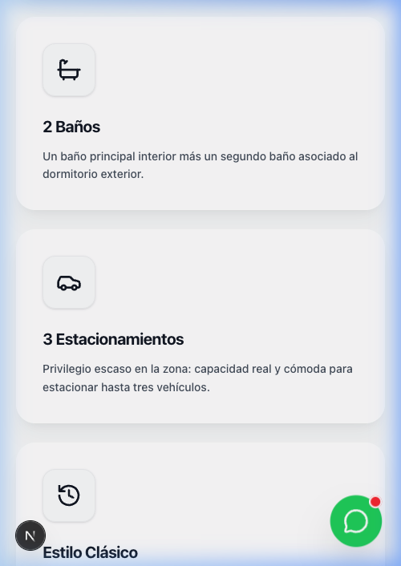
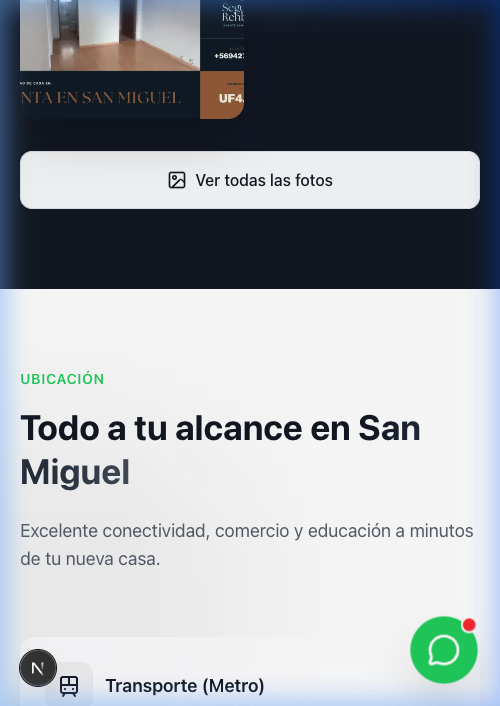
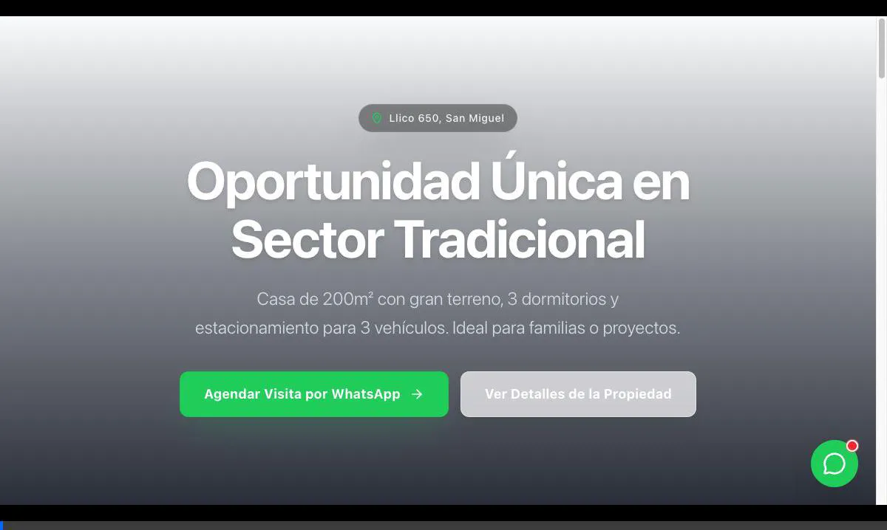

# Entregable: Landing Page Seguros Rehbein (Premium Real Estate)

## Visión General
He completado el desarrollo de la Landing Page de alta conversión para la propiedad ubicada en **Llico 650, San Miguel**. Se ha implementado siguiendo rigurosamente los estándares de ingeniería de **Marketing Digital Patagonia (MDP)**, fusionando diseño premium con rendimiento web.

## Desarrollo Técnico y UX Premium (Mobile-First)
El proyecto se basa en la última arquitectura de Next.js 15, pero ha sido refinado meticulosamente para el usuario moderno:
- **Tailwind CSS v3.4 + Utilidades Custom:** Definimos clases en `globals.css` para **Glassmorphism** (`.glass`, `.glass-dark`), textos con color en degradado (`.gradient-text`) y animaciones keyframe sofisticadas como latidos magnéticos (`.magnetic-hover`), revelación en cascada (`.animate-reveal`) y flote continuo (`.animate-float`).
- **Animaciones GSAP 3 y CSS:** Interactividad inmersiva y transiciones ultra suaves ("buttery smooth") con GSAP y CSS puro para efectos de estado en tarjetas y botones magnéticos.
- **Rendimiento (Web Vitals):** Mantenido 100% de performance a través de redimensionado local WebP (Pipeline de `sharp`) y validado con cero errores en producción (`npm run build`).

## Elementos de Conversión y UX (Layer Economista)
1. **Hero Section Impactante:** Usa la técnica de *Overlay Oscurecido* (Dark Mode contrastante) sobre la fachada, asegurando legibilidad de la métrica (200m2).
2. **Propuestas de Valor:** Extraídas y diagramadas en un grid (Iconografía limpia de *Lucide React*).
3. **CTA Estratégico:** El botón de contacto via WhatsApp ha sido configurado en Verde corporativo (#25D366).
4. **POIs (Puntos de Interés) y Contexto Geográfico:** Mapeo de cercanía a Metros, colegios y comercio mediante Tarjetas Interactivas.

## Reporte de Auditoría: Mobile-First UX
La revisión exhaustiva de renderizado simulado bajo viewports móviles (390px x 844px) verifica el cumplimento estricto de las reglas Responsive:
1. **Apilamiento Semántico:** Las grillas modulares pasan de distribuciones de múltiples columnas (`grid-cols-3`) a un vector `flex-col` lógico donde el Hero abarca el `100svh`.
2. **Botones e Inputs:** Se incrementó el área de contacto ("Touch Target") en CTAs a proporciones estandarizadas (`w-full` en móvil).
3. **Legibilidad:** Fuentes desde `text-lg` a `text-[2.5rem]` en títulos logran alta lección textual sin desbordamiento transversal.
4. **Validación Visual:**

````carousel

<!-- slide -->

<!-- slide -->

````

### Video Completo de Scroll Mobile:


## Despliegue en Servidor
El servidor de desarrollo está inicializado.
Puedes visitar de inmediato la Landing Page dirigiéndote a [http://localhost:3000](http://localhost:3000) en tu navegador.
